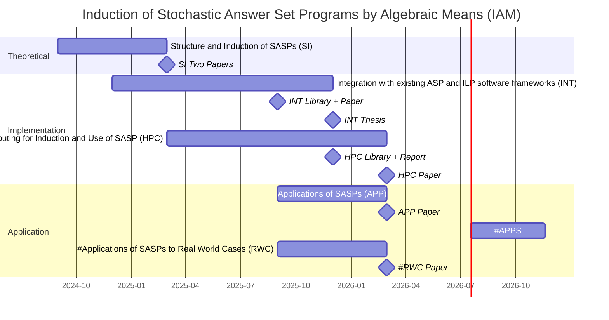

<!--
- **Project timeline and management.** list of milestones, the timeline and the description of the management structure
  - **Milestones list**
    - milestone = objective achieved; phase completed; result obtained
    - include what can be demonstrated or reported on that date
    - up to 6 milestones
    - select tasks associated with the milestone
    - mark milestones on the **timeline**.
  - **Timeline**
    - start with the available spreadsheet
    - upload "timeline.pdf"
    - Indicate **partner responsible for task**; **acronyms of partners involved**
  - **Management** project management structure: coordination; meetings; reporting structure

-->

<!-- 
### Task APPS

- **Denomination**
  - Applications of SASPs in Statistic Tasks
- **Description and expected results**
    - **Objectives**: [TODO]
    - **Methods**: [TODO]
    - **Expected results**: [TODO]
    - **Links to other tasks**: [TODO] (preconditions and results)
    - **Partners and Institution roles**: Universidade de Évora [TODO] [ROLES]
    - **Justification for the needed resources**: [TODO]
- **Assigned team members**
  - [TODO] Member
- **Person * Month**
  - [TODO]
- **Deliverables**
  - [TODO]Type  and Description; evidences and results
- **Budget**
  - [TODO] Item justification (criteria of N.4 from "Public Announcement of the Call")
  - [TODO] Amount requested for the task: Include 25% overheads; Consistent with the _Principal Contractor Budget table in application form_; Ensure "total amount of funding requested by institution" = "total costs of the tasks in which the institution participates"
-->

<!-- 
### Task RWC

- **Denomination**
  - Applications of SASPs to Real World Cases 
- **Description and expected results**
    - **Objectives**: Apply SASP, and SASP induction, to some real world cases described in the relevant literature (eg [TODO]).
    - **Methods**: Gather information in the form of background knowledge (eg from experts) and data (positive and negative examples) about the selected problem; Evaluate hand-coded and induced SASPs in that problem; Compare with other approaches to that problem. 
    - **Expected results**: Assessment of the performance of hard-coded and induced SASPs on the selected problem; List of advantages and problems.
    - **Links to other tasks**:
      - Preconditions from other tasks: Libraries, and respective documentation, from tasks IFS and HPC.
      - Results for other tasks: None - This is a final task.
    - **Partners and Institution roles**:
      - Universidade de Évora, Principal contractor;
    - **Justification for the needed resources**:  
      - A member should present the results of this task in an international conference, requiring support for registration, travel, per diem.
      - An HPC system is required to this task.
- **Assigned team members**
  - Francisco Coelho, Universidade de Évora
  - [TODO], [TODO]
- **Person * Month**
  | Member           | Percentage | Months | P*M |
  |------------------|-----------:|:------:|----:|
  | Francisco Coelho |      16.7% |   6    | 1.0 |
  | [TODO]           |      16.7% |   6    | 1.0 |
  | **Total**        |            |        | 2.0 |
- **Deliverables**
  - A paper accepted in a A* or A international conference or Q1 journal, by 2026-03-01.
- **Budget**
  | Item                                                       |   Amount |
  |------------------------------------------------------------|---------:|
  | Registration, travel, per diem in international conference | 3000.00€ |
  | HPC system                                                 |  500.00€ |
  | Overheads (25%)                                            |  875.00€ |
  | **Total**                                                  | 4375.00€ |
  
-->

<!-- 

### Task TaskID

- **Denomination**
  - [TODO] concise and self-explanatory
- **Description and expected results**
    - **Objectives**: [TODO]
    - **Methods**: [TODO]
    - **Expected results**: [TODO]
    - **Links to other tasks**: [TODO] (preconditions and results)
    - **Partners and Institution roles**: Universidade de Évora [TODO] [ROLES]
    - **Justification for the needed resources**: [TODO]
- **Assigned team members**
  - [TODO] Member
- **Person * Month**
  - [TODO]
- **Deliverables**
  - [TODO]Type  and Description; evidences and results
- **Budget**
  - [TODO] Item justification (criteria of N.4 from "Public Announcement of the Call")
  - [TODO] Amount requested for the task: Include 25% overheads; Consistent with the _Principal Contractor Budget table in application form_; Ensure "total amount of funding requested by institution" = "total costs of the tasks in which the institution participates" 
 
-->

<!--
### Task LP.ERR

- **Denomination**
  - The Role of the Error Function
- **Description and expected results**
    - **Objectives**: Explore the role of the error function, used to score a probabilistic ASP wrt observations, in the performance of methods and applications.
    - **Methods**: Investigate variations of the error function, eg Kullback-Leibler divergence instead of the L2 used, observation sets form various domains, and the resulting effects.
    - **Expected results**: One paper accepted in A* or A international conference or Q1 journal.
    - **Links to other tasks**: [TODO] (preconditions and results)
    - **Partners and Institution roles**: Universidade de Évora [TODO] [ROLES]
    - **Justification for the needed resources**: A member should present the results of this task in an international conference, requiring support for registration, travel, per diem.
- **Assigned team members**
  - Francisco Coelho, Universidade de Évora
  - Ligia Henriques-Rodrigues, Universidade de Évora
- **Person * Month**
  - [TODO]
- **Deliverables**
  - Paper THREE in International Conference: M01 - M08
- **Budget**
  - Registration, travel, per diem for conference THREE: 3000.00€
  - Total, including 25% overheads: 3750.00€
-->

<!--
### Task LP.EQ

- **Denomination**
  - Equivalence Relations in Scoring Programs
- **Description and expected results**
    - **Objectives**: Clarify the role of the equivalence relation, used to partition the event space, on the performance of algorithms related to classes and respective probabilities. 
    - **Methods**: Investigate variations of the equivalence relation (eg, considering only super-events instead of super- and sub-events) and the resulting effects on algorithms related to classes and respective probabilities.
    - **Expected results**: Assessment on the effects of the variations of the equivalence relation on algorithms related to classes and respective probabilities.
    - **Links to other tasks**:
      - Preconditions from other tasks: 
        - SI: Program structure and composition elements, assessed in task SI, contribute to determine the stable models that are, in turn, used to define the equivalence relation, studied here. 
      - Results for other tasks: 
        - APP and RWC - The equivalence relation associates certain events to certain stable models and from this association results event probability. In applications, either theoretical scenarios or real world cases, models (in this case, SASPs) must support the calculus of event probabilities.
    - **Partners and Institution roles**:
      - Universidade de Évora, Principal contractor;
    - **Justification for the needed resources**: A member should present the results of this task in an international conference, requiring support for registration, travel, per diem.
- **Assigned team members**
  - Francisco Coelho, Universidade de Évora
  - Bruno Dinis, Universidade de Évora
- **Person * Month**
  | Member           | Percentage | Months | P*M |
  |------------------|-----------:|:------:|----:|
  | Francisco Coelho |      16.7% |   6    | 1.0 |
  | Bruno Dinis      |      16.7% |   6    | 1.0 |
  | **Total**        |            |        | 2.0 |
- **Deliverables**
  - A paper accepted in a A* or A international conference or Q1 journal, by 2026-02-01.
- **Budget**
  | Item                                                       |   Amount |
  |------------------------------------------------------------|---------:|
  | Registration, travel, per diem in international conference | 3000.00€ |
  | Overheads (25%)                                            |  750.00€ |
  | **Total**                                                  | 3750.00€ |
-->

<!-- 
### Task ISE

- **Denomination**
  - Inductive Stochastic Answer Set Programs by Space Exploration
- **Description and expected results**
    - **Objectives**: Proceed from already established (in existing research) scoring programs methods to induce Stochastic Answer Set Programs (SASPs) using program space exploration algorithms based on program transformation rules (eg genetic algorithms).
    - **Methods**: Investigate program transformation rules and program space exploration algorithms in the context of SASPs.  
    - **Expected results**: Compilation and assessment of program transformation rules and space explorations algorithms for SASPs.
    - **Links to other tasks**:
      - Preconditions from other tasks: None - this is an initial task, a continuation of already done research;
      - Results for other tasks: 
        - HPC, APP, RWC: This is an algorithm oriented research task; its results are to be utilized by the subsequent application tasks: HPC for induction and use of SASPs (HPC), Application of SASPs in Theoretic Scenarios (APP) and Applications of SASPs to Real World Cases (RWC). 
        - INT: Induction of SASPs from data and background knowledge, in task INT, requires the assessments of program space exploration algorithms and program transformation rules.
    - **Partners and Institution roles**:
      - Universidade de Évora, Principal contractor;
    - **Justification for the needed resources**: A member should present the results of this task in an international conference, requiring support for registration, travel, per diem.
- **Assigned team members**
  - Francisco Coelho, Universidade de Évora
  - Salvador Abreu, Universidade de Évora
- **Person * Month**
  | Member           | Percentage | Months | P*M |
  |------------------|-----------:|:------:|----:|
  | Francisco Coelho |      16.7% |   6    | 1.0 |
  | Salvador Abreu   |      16.7% |   6    | 1.0 |
  | **Total**        |            |        | 2.0 |
- **Deliverables**
  - A paper accepted in a A* or A international conference or Q1 journal, by 2025-03-01.
- **Budget**
  | Item                                          |   Amount |
  |-----------------------------------------------|---------:|
  | Registration in international conference (x2) | 1400.00€ |
  | Travel to international conference (x2)       | 1000.00€ |
  | Per diem international conference (x3x2)      | 1152.00€ |
  | Overheads (25%)                               |  888.00€ |
  | **Total**                                     | 4440.00€ | -->

# Tasks

## Task List

### Task SI

- **Denomination**
  -  Structure and Induction of SASP (SI)
- **Description and expected results:**
  - **Objectives**: Clarify the role of Stochastic Answer Set Programs (SASPs) structure and composition elements (eg stratified or recursive  programs, functional symbols) in the stable models, our equivalence relation of events, and existing ASP and ILP systems; Proceed from already established (in existing research) scoring programs methods to SASPs using program space exploration algorithms based on program transformation rules (eg genetic algorithms). 
  - **Methods**: Investigate SASP structures and composition elements, how they affect stable models, event classes, and respective probability; Investigate program transformation rules and program space exploration algorithms in the context of SASPs.
  - **Expected results**: Assessment on the effects of the studied structures and composition elements on  stable models, event classes, and respective probability; Compilation and assessment of program transformation rules and space explorations algorithms for SASPs.
  - **Links to other tasks**:
    - Preconditions from other tasks: None - this is an initial task, a continuation of already done research;
    - Results for other tasks: 
      - INT, HPC: This task gives important insights into algorithm design and implementation,  for the computation of the event classes and respective probabilities, either in a sequencial setting (INT task) or distributed (HPC task).
  - **Partners and Institution roles**: 
    - Universidade de Évora, Principal contractor;
  - **Justification for the needed resources**: A member should present the results of this task in an international conference, requiring support for registration, travel, per diem.
- **Assigned team members:**
  - Francisco Coelho, Universidade de Évora;
  - Salvador Abreu, Universidade de Évora;
  - Bruno Dinis, Universidade de Évora;
- **Start Date:** 2024-09-01
- **Duration (months):** 6
- **Person * Month:**
  | Member           | Percentage | Months | P*M |
  |------------------|-----------:|:------:|----:|
  | Francisco Coelho |      16.7% |   6    | 1.0 |
  | Salvador Abreu   |      16.7% |   6    | 1.0 |
  | Bruno Dinis      |      16.7% |   6    | 1.0 |
  | **Total**        |            |        | 3.0 |
- **Deliverables:**
  - Two papers accepted in A* or A international conferences or Q1 journals, by 2025-03-01.
- **Budget**
  Registration in international conference (x2) , 1400.00€
  Travel to international conference (x2)       , 1000.00€
  Per diem international conference (x3x2)      , 1152.00€
  Overheads (25%)                               ,  888.00€
  **Total**                                     , 4440.00€

### Task INT

- **Denomination**
  - Integration with existing ASP and ILP software frameworks (INT)
- **Description and expected results**
    - **Objectives**: A library, and its documentation, to enable efficient SASP related computations: parsing, event classes and probabilities, induction.
    - **Methods**: Implement, test, document and demonstrate a library to process SASP programs (parse the SASP language; utilize existing ASP frameworks to compute stable models; compute the event classes and respective probabilities; induce SASPs from data).
    - **Expected results**: A library that implements the algorithms proposed in previous tasks and existing research, to be utilized in future applications and tasks, and associated documentation; A PhD graduation; Contributions to existing ASP frameworks, such as Potassco. 
    - **Links to other tasks**: 
      - Preconditions from other tasks: None - this is an initial task, a continuation of already done research; However, results from task SI will guide the implementation for induction of SASPs from data and background knowledge.
      - Results for other tasks: 
        - HPC: A proposed library API, to guide the implementation in the HPC task.
        - APP: This applied task requires adequate software support, ie the library and documentation delivered by this task. 
    - **Partners and Institution roles**:
      - Universidade de Évora, Principal contractor;
    - **Justification for the needed resources**: The implementation volume and complexity requires a fulltime PhD student working over a year, using a suitable laptop; The PhD student should present the results of this task in an international conference, requiring support for registration, travel, per diem.
- **Assigned team members**
  - Francisco Coelho, Universidade de Évora;
  - BI Scholarship fellow, Universidade de Évora;
- **Start Date:** 2024-12-01
- **Duration (months):** 12
- **Person * Month**
  | Member                | Percentage | Months |  P*M |
  |-----------------------|-----------:|:------:|-----:|
  | Francisco Coelho      |      16.7% |   12   |  2.0 |
  | BI Scholarship fellow |     100.0% |   12   | 12.0 |
  | **Total**             |            |        | 14.0 |
- **Deliverables**
  - Proposal for the library API, by 2025-03-01.
  - Report documenting the features and progress in the library implementation, by 2025-06-01.
  - Paper accepted in a A* or A international conference or Q1 journal, by 2025-09-01.
  - Library, and the respective documentation, to parse SASP; interface with existing ASP frameworks; compute event classes and respective probabilities, by 2025-06-01.
  - Completed PhD thesis, by 2025-12-01.
- **Budget**
  | Item                                         |    Amount |
  |----------------------------------------------|----------:|
  Laptop Computer (i7; 32GB RAM; 1TB SSD; 15")  2658.21€
  Registration in international conference       700.00€
  Travel to international conference            1000.00€
  Per diem international conference (x3)         576.00€
  BI Scholarship (12 months, 1144.64€/month)   13735.68€
  Overheads (25%)                               4667.47€
  **Total**                                    23337.36€

### Task HPC

- **Denomination**
  - High Performance Computing for Induction and Use of SASPs (HPC)
- **Description and expected results**
    - **Objectives**: Use High Performance Computing systems to speedup and scale-up applications of SASPs.
    - **Methods**: Benchmark the benefits of data and process distribution for SASPs on High Performance Computing systems. 
    - **Expected results**: Compilation and assessment of distributed SASPs on HPC systems; A library that implements distributed versions of some API functions described in the INT task, to be utilized in future applications and tasks, and associated documentation; 
    - **Links to other tasks**:
      - Preconditions from other tasks: 
        - INT: The proposed library API is utilized to guide this task implementation, in order to strive for compatibility.
        - SI: Results from task SI will guide the implementation for induction of SASPs from data and background knowledge.
      - Results for other tasks:
        - APP: This applied task requires adequate software support, ie the library and documentation delivered by this task.
    - **Partners and Institution roles**: 
      - Universidade de Évora, Principal contractor;
      - High Performance Computing Chair, Research Unit;
    - **Justification for the needed resources**: 
      - A member should present the results of this task in an international conference, requiring support for registration, travel, per diem.
      - Adaptation of sequential programs to HPC systems requires expert consultation.
      - An HPC system is required to this task.
- **Assigned team members**
  - Francisco Coelho, Universidade de Évora
  - Miguel Avillez, High Performance Computing Chair (as Consultant)
- **Start Date:** 2025-03-01
- **Duration (months):** 12
- **Person * Month**
  | Member           | Percentage | Months | P*M |
  |------------------|-----------:|:------:|----:|
  | Francisco Coelho |      16.7% |   12   | 2.0 |
  | Miguel Avillez   |      16.7% |   12   | 2.0 |
  | **Total**        |            |        | 4.0 |
- **Deliverables**
  - Report on the performance of the distributed versions of the programs to interface with existing ASP frameworks and compute event classes and respective probabilities, by 2025-09-01.
  - A library or set of programs for distributed evaluation of SASP on HPC systems, by 2025-12-01. 
  - Paper accepted in a A* or A international conference or Q1 journal, by 2026-03-01.
- **Budget**
  | Item                                     |   Amount |
  |------------------------------------------|---------:|
  Registration in international conference   700.00€
  Travel to international conference        1000.00€
  Per diem international conference (x3)     576.00€
  HPC system                                1000.00€
  Overheads (25%)                            819.00€
  **Total**                                 4095.00€

### Task APP

- **Denomination**
  - Applications of SASPs (APP)
- **Description and expected results**
    - **Objectives**: Apply SASP, and SASP induction, to some theoretic scenarios (toy problems) described in the relevant literature (eg Stochastic Plan Generation, Logic/Statistic Puzzles) as well as to some real world cases (eg [TODO]).
    - **Methods**: Compile a set of theoretic and real-world problems; Gather information in the form of background knowledge (eg from experts) and data (positive and negative examples) about selected problems; Evaluate hand-coded and induced SASPs on that set; Compare with state-of-the-art results. 
    - **Expected results**: Assessment of the performance of hard-coded and induced SASPs with respect to selected theoretical and real-world problems.
    - **Links to other tasks**:
      - Preconditions from other tasks: Libraries, and respective documentation, from tasks IFS and HPC.
      - Results for other tasks: None - This is a final task.
    - **Partners and Institution roles**:
      - Universidade de Évora, Principal contractor;
      - High Performance Computing Chair, Research Unit;
    - **Justification for the needed resources**:  
      - A member should present the results of this task in an international conference, requiring support for registration, travel, per diem.
      - An HPC system is required to this task.
- **Assigned team members**
  - Francisco Coelho, Universidade de Évora
  - Salvador Abreu, Universidade de Évora
  - Miguel Avillez, High Performance Computing Chair
- **Start Date:** 2025-09-01
- **Duration (months):** 6
- **Person * Month**
  | Member           | Percentage | Months | P*M |
  |------------------|-----------:|:------:|----:|
  | Francisco Coelho |      16.7% |   6    | 1.0 |
  | Salvador Abreu   |      16.7% |   6    | 1.0 |
  | Miguel Avillez   |      16.7% |   6    | 1.0 |
  | **Total**        |            |        | 3.0 |
- **Deliverables**
  - A paper accepted in a A* or A international conference or Q1 journal, by 2026-03-01.
- **Budget**
  | Item                                     |   Amount |
  |------------------------------------------|---------:|
  Registration in international conference   700.00€
  Travel to international conference        1000.00€
  Per diem international conference (x3)     576.00€
  HPC system                                 500.00€
  Overheads (25%)                            694.00€
  **Total**                                 3470.00€

## Milestones

### Milestone SI Two Papers

- **Designação:** SI Two Papers
- **Descrição (300):** Two papers accepted in A* or A international conferences or Q1 journals, one describing the effects of structures and composition elements on SASP on stable models, event classes, and respective probability; other describing program transformation rules and space exploration algorithms for SASPs.
- **Tarefas:** Structure and Induction of SASPs (SI)
- **Data:** 2025-03-01

### Milestone INT API

- **Designação:** INT API
- **Descrição (300):** A proposal for the API of a library and set of programs to support the evaluation of SASP.
- **Tarefas:** Integration with existing ASP and ILP software frameworks (INT) 
- **Data:** 2025-03-01

### Milestone INT Report

- **Designação:** INT Report
- **Descrição (300):** A report describing the implementation and documenting the use of a library and set of programs to support the evaluation of SASP.
- **Tarefas:** Integration with existing ASP and ILP software frameworks (INT) 
- **Data:** 2025-06-01

### Milestone INT Paper

- **Designação:** INT Paper
- **Descrição (300):** A paper accepted in a A* or A international conference or Q1 journal, describing the features, strengths and limitations of a library and set of programs to support the evaluation of SASP.
- **Tarefas:** Integration with existing ASP and ILP software frameworks (INT) 
- **Data:** 2025-09-01

### Milestone INT Library

- **Designação:** INT Library
- **Descrição (300):** A library and set of programs to support the evaluation of SASP.
- **Tarefas:** Integration with existing ASP and ILP software frameworks (INT) 
- **Data:** 2025-09-01

### Milestone INT Thesis

- **Designação:** INT Thesis
- **Descrição (300):** A PhD thesis about SASP and a library and set of programs to support the evaluation of SASP.
- **Tarefas:** Integration with existing ASP and ILP software frameworks (INT) 
- **Data:** 2025-12-01

### Milestone HPC Library + Report

- **Designação:** HPC Library + Report
- **Descrição (300):** A library or set of programs for distributed evaluation of SASP on HPC systems and a report organizing and documenting the use of that library. 
- **Tarefas:** High Performance Computing for Induction and Use of SASP (HPC)
- **Data:** 2025-12-01

### Milestone HPC Paper

- **Designação:** HPC Paper
- **Descrição (300):** A paper accepted in a A* or A international conference or Q1 journal, describing compilation and assessment of distributed SASPs on HPC systems.
- **Tarefas:** High Performance Computing for Induction and Use of SASP (HPC)
- **Data:** 2026-03-01

### Milestone APP Paper

- **Designação:** APP Paper
- **Descrição (300):** A paper accepted in a A* or A international conference or Q1 journal, assessing the performance of hard-coded and induced SASPs with respect to selected theoretical and real-world problems.
- **Tarefas:** Applications of SASPs (APP)
- **Data:** 2026-03-01

## Project Timeline

---

Explain the participation of a post-doc student  of informatics in an task with objectives, methodologies and expected results given below.

Objectives

Support the application of SASP for modeling probabilistic processes and induce SASP from Background Knowledge (BK) and evidence.

Methodologies and approaches

Implementation (i.e., writing code according to the software design specifications), testing (i.e., verification that the implemented software functions correctly and meets the requirements outlined in the design phase), profiling (i.e., analyzing the performance of the software system to identify bottlenecks, memory leaks, and other performance issues), benchmarking (i.e., compare the performance of the software system against standard benchmarks or competitors' products) and documenting (i.e., providing comprehensive information about the software system, including its purpose, features, architecture, installation instructions, and usage guidelines): 
    SASP intermediate representation and a parser.
    Integration with existing, state of the art, Answer Set Program (ASP) tools such as Potassco and cplint for the computation of the stable models.
    Instrumental functions such as: event belongs to class, class probability, event probability.
    Support for SASP combination and transformation.
    Integration with existing, state of the art, evolutionary explorations tools (e.g. genetic algorithms).
    Command-line programs to support basic usage such as: list classes, query the probability of an event or class, induce SASP.

Expected results

A basic set of tools, including a library and command-line programs, to use Stochastic Answer Set Programs (SASP) for modeling probabilistic processes and induce SASP from Background Knowledge (BK) and evidence.

---

Consider the STATE-OF-THE-ART, the OBJECTIVES and the REFERENCES below.

Rewrite the STATE-OF-THE-ART and the OBJECTIVES raking into account the given REFERENCES and possibly others.

The text must have less than 5500 characters.

STATE-OF-THE-ART

A major limitation of logical representations in real world applications is the implicit assumption that the background knowledge (BK) is perfect. This assumption is problematic when dealing with probabilistic phenomena, which is often the case. Probabilistic Logic Programming (PLP) is one ongoing effort to address this problem by extending the syntax and semantics of logic programs in order to have them represent and operate probability distributions (see [11]).

Current systems for PLP, such as ProbLog [5], P-log [3], LP^MLN [6], or cplint [7], derive a probability distribution from a program. However, for Answer Set Programs (ASP) [12] with probabilistic facts, the characterization of a probability distribution on the program's domain is not straightforward (see [1, 2, 3, 4]).

In [8] we address the problem of extending probability from the total choices of an ASP program to its stable models and, from there, to general events. Our approach is algebraic in the sense that it relies on an equivalence relation over the set of events and uncertainty is expressed with variables and polynomial expressions. In that work we show how SASP can represent arbitrary bayesian networks and therefore express any probability distribution of discrete random variables.

This representation of arbitrary bayesian networks conferes to SASP the capability to deal with a very large collection of probability problems and tasks. However, the problem of obtaining such SASP, besides hand-coded, remains open. 

In our system some unknowns are represented by numeric parameters that can be estimated later from further information, e.g., evidence. This approach, delaying the assignment of certain parameters, enables later refinement and scoring a partial program from additional evidence. 

In turn, scoring of SASP (i.e., models of a probabilistic phenomenon) is a key feature required to the application of evolutionary algorithms. From here we can explore how to induce SASP from BK and evidence.

The calculus of the score of an SASP with respect to evidence was already introduced and illustrated in [8]. It remains to investigate the application of this process to induction of SASP from BK and evidence. 

Ideas of this paper have a partial, limited, implementation, available in a public repository, that results from the work of a BII scholarship, supported by NOVALINCS "Financiamento Plurianual da unidade de I&D UIDP/04516/2020" and co-supported by Fundação para a Ciência e a Tecnologia (FCT), Portugal.

In the general Induction of Logic Programs (ILP) setting (see [11, 13]) the goal is to algorithmically obtain a (target) logic program. For that, (1) BK (e.g., obtained from experts) is provided in the form of a logic program, describing objects and (first-order) relations of a domain and (2) observations are organized as positive evidence, that should be inferred from the target program, and negative evidence, that should not be inferred from the target program. Moreover, the target program must be (logically) consistent with the BK. ILP is a form of Machine Learning (ML) that offers significant advantages over numeric based ML. 

For one, ILP address the problem of Explainable Artificial Intelligence (XAI) because, unlike  the large-dimensional vector based models of numeric ML, logic programs are human-readable in the sense that their declarative nature describes what objects are in the domain, their structure, properties and relations.
Second, ILP describes phenomena with related instances while numeric ML is limited to a single (tabulated) relation where different instances (lines) are independent given the model. 
Third, often a target program is generated from a small set of observations, while, in general, numeric ML models require large datasets to achieve significant accuracy.
At last, expert knowledge, expressed in the BK, can be utilized to structure the target program, i.e., to model the observations. Again, this is a feature hard to achieve with numeric ML models.

Drawbacks of ILP include the computational complexity of inducing the target program and the general difficulty of logic programs to deal with data with random perturbations. While the later is being addressed by PLP in general and SASP in particular, the computational complexity of induction remains an important challenge that we propose to investigate with this project.

OBJECTIVES

In summary, with this project we aim to continue our exploration on how SASP represent probability distributions, how to use them to model probabilistic phenomena and how they can be induced from BK and evidence.

More specifically, this project's objectives are to investigate:

- The role of program structure and composition in the use of PASP to model probabilistic phenomena.
- Program transformation rules and space exploration algorithms for SASP.
- The performance of hand-coded and induced SASP models on selected theoretic and real world cases.

REFERENCES

1. Cozman, F. G., & Mauá, D. D. (2020). The joy of probabilistic answer set programming: Semantics, complexity, expressivity, inference. International Journal of Approximate Reasoning, 125, 218-239.
2. Verreet, V., Derkinderen, V., Dos Martires, P. Z., & De Raedt, L. (2022, June). Inference and learning with model uncertainty in probabilistic logic programs. In Proceedings of the AAAI Conference on Artificial Intelligence (Vol. 36, No. 9, pp. 10060-10069).
3. Baral, C., Gelfond, M., & Rushton, N. (2009). Probabilistic reasoning with answer sets. Theory and Practice of Logic Programming, 9(1), 57-144.
4. Pajunen, J., & Janhunen, T. (2021). Solution enumeration by optimality in answer set programming. Theory and Practice of Logic Programming, 21(6), 750-767.
5. De Raedt, L., Kimmig, A., & Toivonen, H. (2007). ProbLog: A probabilistic Prolog and its application in link discovery. In IJCAI 2007, Proceedings of the 20th international joint conference on artificial intelligence (pp. 2462-2467). IJCAI-INT JOINT CONF ARTIF INTELL.
6. Lee, J., & Wang, Y. (2016, March). Weighted rules under the stable model semantics. In Fifteenth international conference on the principles of knowledge representation and reasoning.
7. Alberti, M., Bellodi, E., Cota, G., Riguzzi, F., & Zese, R. (2017). cplint on SWISH: Probabilistic logical inference with a web browser. Intelligenza Artificiale, 11(1), 47-64.
8. Coelho, F., Dinis, B., & Abreu, S. (2024).  An Algebraic Approach to Stochastic ASP. Submitted.
9.  Körner, P., Leuschel, M., Barbosa, J., Costa, V.S., Dahl, V., Hermenegildo, M.V., Morales, J.F., Wielemaker, J., Diaz, D., Abreu, S. and Ciatto, G. (2022). Fifty years of Prolog and beyond. Theory and Practice of Logic Programming, 22(6), 776-858.
10. López, J., Múnera, D., Diaz, D., & Abreu, S. (2018). Weaving of metaheuristics with cooperative parallelism. In Parallel Problem Solving from Nature-PPSN XV: 15th International Conference, Coimbra, Portugal, September 8-12, 2018, Proceedings, Part I 15 (pp. 436-448). Springer International Publishing.
11. Riguzzi, F. (2022). Foundations of probabilistic logic programming: Languages, semantics, inference and learning. River Publishers.
12. Lifschitz, V. (2002). Answer set programming and plan generation. Artificial Intelligence, 138(1-2), 39-54.
13. Russell, S. J., & Norvig, P. (2010). Artificial intelligence a modern approach. London.